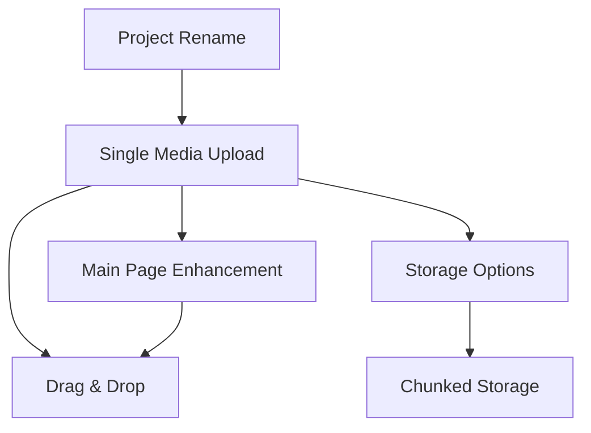

# Media Management Features Implementation Plan

## Overview
This document outlines the comprehensive plan for implementing media management enhancements in the Transcription System. Each feature will be implemented following a structured approach with specific sub-agent assistance.

## Sub-Agents Required

### Planning Phase Agents
1. **architecture-surgeon** - Plan refactoring without breaking existing functionality
2. **project-organizer** - Understand current structure and plan folder/media organization
3. **api-architect** - Design new API endpoints for media operations

### Execution Phase Agents
1. **media-sync-engineer** - Implement drag-and-drop and media loading features
2. **theme-coordinator** - Adjust green theme styling
3. **hebrew-rtl-processor** - Ensure proper RTL layout
4. **performance-optimizer** - Implement chunked storage
5. **backup-guardian** - Handle storage options (local vs server)
6. **integration-engineer** - Implement chunked storage system
7. **session-chronicler** - Document implementation sessions
8. **transcription-validator** - Validate data integrity after changes

## Feature Implementations

### Feature 1: Single Media Upload Button
**Priority:** High  
**Complexity:** Medium  
**Location:** Sidebar (`TranscriptionSidebar.tsx`)

#### Requirements:
- Add "הוסף מדיה" button next to "הוסף פרויקט"
- Modal with file input and name field
- Auto-generate folder name: `YYYY-MM-DD_HH-MM-SS`
- Allow custom name override
- Create project structure automatically

#### Sub-Agents:
- **Planning:** `project-organizer`, `api-architect`
- **Execution:** `media-sync-engineer`, `hebrew-rtl-processor`
- **Testing:** `transcription-validator`

#### Implementation Stages:
1. Create UI button and modal component
2. Implement file selection logic
3. Add API endpoint for single media project creation
4. Update project store to handle new project type
5. Test with various media formats
6. Ensure Hebrew RTL support

---

### Feature 2: Drag & Drop Functionality
**Priority:** High  
**Complexity:** High  
**Locations:** Sidebar, Main Page תמלול column

#### Requirements:
- **Folder Drop:** Create new project
- **Media Drop:**
  - On existing project: Add to project
  - On empty area: Create new project
- Visual feedback during drag
- Support multiple file types

#### Sub-Agents:
- **Planning:** `architecture-surgeon`, `project-organizer`
- **Execution:** `media-sync-engineer`, `performance-optimizer`
- **Testing:** `transcription-validator`

#### Implementation Stages:
1. Implement HTML5 Drag & Drop API handlers
2. Create drop zone components
3. Add visual feedback (hover states, drop indicators)
4. Implement file type detection
5. Handle folder vs file logic
6. Add progress indicators for uploads
7. Test with various file sizes and types

---

### Feature 3: Project Rename Capability
**Priority:** Medium  
**Complexity:** Low  
**Location:** Sidebar, Project Management Modal

#### Requirements:
- Edit icon next to project names
- Inline editing or modal
- Update all references (database, file system)
- Maintain data integrity

#### Sub-Agents:
- **Planning:** `api-architect`
- **Execution:** `backup-guardian`, `transcription-validator`
- **Testing:** `transcription-validator`

#### Implementation Stages:
1. Add edit UI components
2. Create rename API endpoint
3. Implement file system rename logic
4. Update database references
5. Handle edge cases (duplicate names, special characters)
6. Test with active projects

---

### Feature 4: Main Page תמלול Column Enhancement
**Priority:** High  
**Complexity:** Medium  
**Location:** Main transcription page

#### Requirements:
- Match exact dark green (#20c997) from MediaPlayer
- Display real projects with metadata
- Link projects to transcription page
- "תמלול חדש" with three options
- Drag & drop support

#### Sub-Agents:
- **Planning:** `theme-coordinator`, `architecture-surgeon`
- **Execution:** `theme-coordinator`, `hebrew-rtl-processor`, `media-sync-engineer`
- **Testing:** `transcription-validator`

#### Implementation Stages:
1. Update CSS to match exact theme colors
2. Fetch and display real project data
3. Implement project cards with links
4. Create "תמלול חדש" modal with options
5. Add drag & drop to column area
6. Test responsive design

---

### Feature 5: Local vs Server Storage Options
**Priority:** Medium  
**Complexity:** High  
**Location:** Project settings, Backend storage service

#### Requirements:
- Storage preference per project
- Upload/download mechanisms
- Storage status indicators
- Migration between storage types

#### Sub-Agents:
- **Planning:** `api-architect`, `backup-guardian`
- **Execution:** `backup-guardian`, `integration-engineer`
- **Testing:** `performance-optimizer`, `transcription-validator`

#### Implementation Stages:
1. Add storage preference to project model
2. Create upload service for server storage
3. Implement download/streaming for server files
4. Add storage status indicators
5. Create migration utility
6. Test with large files

---

### Feature 6: Chunked Storage Implementation
**Priority:** Low  
**Complexity:** Very High  
**Location:** Backend storage service

#### Requirements:
- Split files into 5MB chunks
- Store chunk metadata
- Reassemble for playback
- Resume capability
- Storage optimization

#### Sub-Agents:
- **Planning:** `api-architect`, `performance-optimizer`
- **Execution:** `integration-engineer`, `performance-optimizer`, `backup-guardian`
- **Testing:** `performance-optimizer`, `transcription-validator`

#### Implementation Stages:
1. Design chunk storage schema
2. Implement file splitting algorithm
3. Create chunk upload/download handlers
4. Build reassembly service
5. Add resume capability
6. Implement cleanup for orphaned chunks
7. Performance testing with large files

## Implementation Workflow Template

For each feature implementation:

### 1. Planning Phase
```markdown
## Feature: [Feature Name]
## File: docs/features/[FEATURE_NAME]_IMPLEMENTATION.md

### Stage 1: Analysis
- [ ] Use `[planning-agent]` to analyze current implementation
- [ ] Document existing code structure
- [ ] Identify impact areas

### Stage 2: Design
- [ ] Use `[design-agent]` to create detailed design
- [ ] Define API contracts
- [ ] Create UI mockups if needed

### Stage 3: Implementation Plan
- [ ] Break down into subtasks
- [ ] Assign sub-agents for each task
- [ ] Define success criteria
```

### 2. Execution Phase
```markdown
### Stage 4: Implementation
- [ ] Use `session-chronicler` to start session
- [ ] Implement core functionality with `[execution-agent]`
- [ ] Add error handling
- [ ] Implement UI components

### Stage 5: Testing
- [ ] Use `transcription-validator` for data integrity
- [ ] Test edge cases
- [ ] Verify Hebrew RTL support
- [ ] Check responsive design

### Stage 6: Bug Fixes
- [ ] Document issues found
- [ ] Fix with appropriate sub-agent
- [ ] Re-test affected areas
```

### 3. Documentation & Commit Phase
```markdown
### Stage 7: Documentation
- [ ] Update feature documentation
- [ ] Add inline code comments
- [ ] Update API documentation

### Stage 8: Git Commit
- [ ] Use `session-chronicler` for commit message
- [ ] Stage all changes
- [ ] Create descriptive commit
- [ ] Push to repository
```

## Technical Specifications

### File Structure
```
transcription-system/
├── frontend/main-app/
│   ├── src/app/transcription/
│   │   ├── components/
│   │   │   ├── TranscriptionSidebar/  # Feature 1, 2, 3
│   │   │   ├── ProjectManagementModal/ # Feature 3
│   │   │   └── MediaPlayer/           # Feature 2
│   │   └── page.tsx                   # Feature 4
│   └── src/services/
│       ├── projectService.ts          # Features 1-6
│       └── storageService.ts          # Features 5, 6
└── backend/
    ├── src/api/
    │   ├── projects/                  # Features 1, 3
    │   └── storage/                   # Features 5, 6
    └── src/services/
        ├── projectService.ts           # Features 1-4
        ├── storageService.ts           # Features 5, 6
        └── chunkService.ts             # Feature 6
```

### Dependencies Between Features


### Testing Requirements
- All features must maintain existing functionality
- Hebrew RTL support must be verified
- Responsive design for screens 768px-1920px
- Permission levels D, E, F must be respected
- Backup system compatibility
- Cross-browser testing (Chrome, Firefox, Edge)

### Success Criteria
Each feature is considered complete when:
1. All functionality works as specified
2. No regression in existing features
3. Tests pass (if automated tests exist)
4. Documentation is updated
5. Code is committed to Git
6. Feature works with Hebrew content
7. Responsive design is maintained

## Implementation Priority Order

### Phase 1 (Week 1)
1. Feature 4: Main Page Enhancement (styling only)
2. Feature 1: Single Media Upload

### Phase 2 (Week 2)
3. Feature 3: Project Rename
4. Feature 2: Drag & Drop

### Phase 3 (Week 3)
5. Feature 5: Storage Options

### Phase 4 (Week 4)
6. Feature 6: Chunked Storage

## Notes
- Each feature should be implemented incrementally
- Test thoroughly before moving to next feature
- Use sub-agents proactively for complex tasks
- Document any deviations from plan
- Create feature branches for version control
- Regular commits with descriptive messages

## Related Documentation
- [SUB_AGENTS_DESIGN.md](./SUB_AGENTS_DESIGN.md) - Sub-agent specifications
- [PROJECT_STATUS.md](./PROJECT_STATUS.md) - Current project status
- [TRANSCRIPTION_PROGRESS_TRACKING.md](./TRANSCRIPTION_PROGRESS_TRACKING.md) - Progress tracking

---
*Last Updated: 2025-09-08*
*Status: Planning Phase*


deo Upload from Internet - Implementation Plan                                    │ │
│ │                                                                                     │ │
│ │ Based on my research, your system currently only supports local file uploads. Here  │ │
│ │ are the options to add video downloading from the internet:                         │ │
│ │                                                                                     │ │
│ │ Current Situation:                                                                  │ │
│ │                                                                                     │ │
│ │ - System only accepts local file uploads (drag & drop or file selection)            │ │
│ │ - You have ffmpeg and yt-dlp already installed on your system                       │ │
│ │ - Backend uses multer for file uploads                                              │ │
│ │                                                                                     │ │
│ │ Proposed Implementation Options:                                                    │ │
│ │                                                                                     │ │
│ │ Option 1: URL Input with Backend Download (Recommended)                             │ │
│ │                                                                                     │ │
│ │ Add a URL input field in the sidebar that:                                          │ │
│ │ 1. Frontend: Add "Upload from URL" button next to existing upload button            │ │
│ │ 2. Frontend: Show modal with URL input field                                        │ │
│ │ 3. Backend: New endpoint /api/projects/upload-from-url that:                        │ │
│ │   - Uses yt-dlp to download video/audio                                             │ │
│ │   - Supports YouTube, Vimeo, and 1000+ other sites                                  │ │
│ │   - Converts to compatible format using ffmpeg if needed                            │ │
│ │   - Creates project with downloaded media                                           │ │
│ │ 4. Progress indication during download                                              │ │
│ │                                                                                     │ │
│ │ Option 2: Browser Extension Integration                                             │ │
│ │                                                                                     │ │
│ │ 1. Create a browser extension that captures video URLs                              │ │
│ │ 2. Extension sends URL to your transcription system                                 │ │
│ │ 3. System downloads and processes the video                                         │ │
│ │                                                                                     │ │
│ │ Option 3: Simple Direct URL Support                                                 │ │
│ │                                                                                     │ │
│ │ For direct media file URLs (mp4, mp3, etc.):                                        │ │
│ │ 1. Frontend validates URL points to media file                                      │ │
│ │ 2. Backend downloads file directly using Node.js                                    │ │
│ │ 3. No yt-dlp needed for direct links                                                │ │
│ │                                                                                     │ │
│ │ Technical Implementation Details:                                                   │ │
│ │                                                                                     │ │
│ │ Frontend Changes:                                                                   │ │
│ │ - Add URL input UI in TranscriptionSidebar                                          │ │
│ │ - Add validation for URL format                                                     │ │
│ │ - Show download progress                                                            │ │
│ │                                                                                     │ │
│ │ Backend Changes:                                                                    │ │
│ │ - New route: POST /api/projects/upload-from-url                                     │ │
│ │ - Execute yt-dlp command: yt-dlp -f best[ext=mp4]/best -o "output.mp4" [URL]        │ │
│ │ - Handle various video platforms automatically                                      │ │
│ │ - Error handling for invalid URLs or failed downloads                               │ │
│ │                                                                                     │ │
│ │ Supported Platforms (via yt-dlp):                                                   │ │
│ │ - YouTube                                                                           │ │
│ │ - Vimeo                                                                             │ │
│ │ - Facebook                                                                          │ │
│ │ - Twitter/X                                                                         │ │
│ │ - Instagram                                                                         │ │
│ │ - TikTok                                                                            │ │
│ │ - And 1000+ more sites                                                              │ │
│ │                                                                                     │ │
│ │ Security Considerations:                                                            │ │
│ │                                                                                     │ │
│ │ - Validate URLs to prevent malicious input                                          │ │
│ │ - Set download size limits                                                          │ │
│ │ - Implement rate limiting                                                           │ │
│ │ - Scan downloaded files for security                                                │ │
│ │ - Use temporary directory with cleanup                                              │ │
│ │                                                                                     │ │
│ │ Would you like me to implement Option 1 with full yt-dlp integration for maximum    │ │
│ │ compatibility?                                                                      │ │
│ ╰──────────────────────────────────